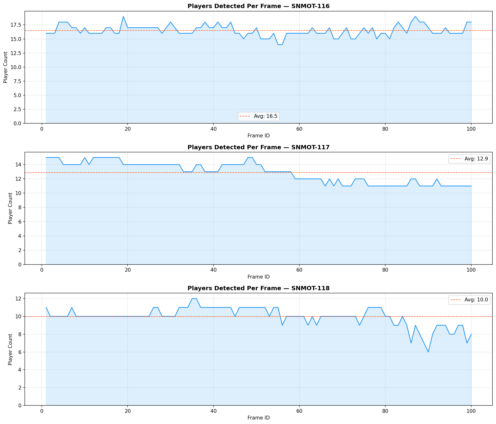
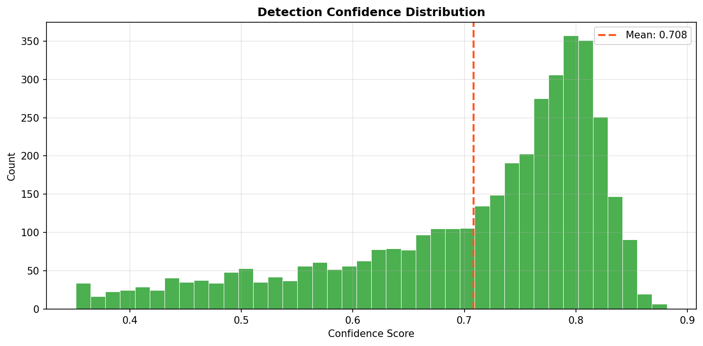
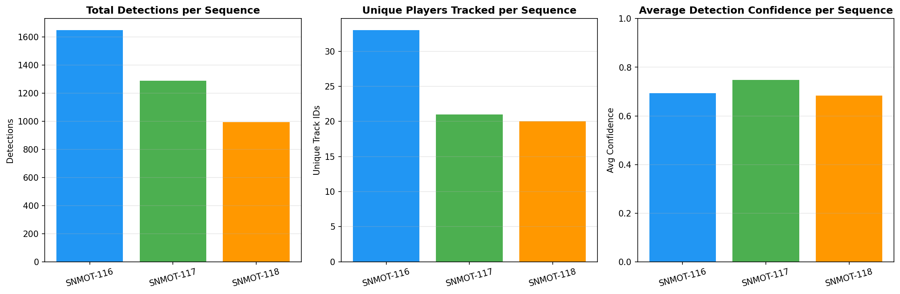
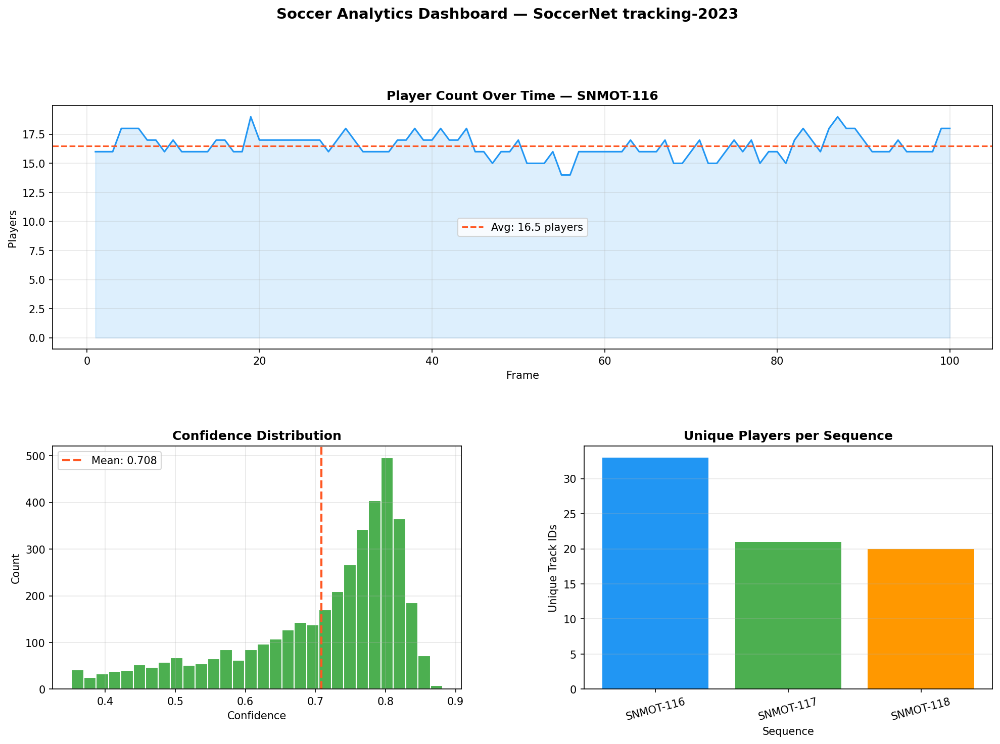

# Soccer Player Detection and Tracking


Real-time multi-object detection and tracking of soccer players
on 1080p broadcast match footage. Fine-tuned YOLO11 on the
SoccerNet tracking-2023 benchmark and evaluated against ground
truth annotations across 7,500 real match frames.


---

## Results

### Training — SoccerNet tracking-2023 (57 sequences, 1080p)

| Metric    | Score    |
|-----------|----------|
| mAP50     | 0.9152 |
| Precision | 0.9282   |
| Recall    | 0.8772   |

### Evaluation on Test Set (10 sequences, 7,500 frames, IoU 0.5)

| Metric    | Score    |
|-----------|----------|
| Precision | 0.9785  |
| Recall    | 0.8043  |
| F1 Score  | 0.8829 |
| TP        | 85,432 |
| FP        | 1,880 |
| FN        | 20,790 |

Evaluated on 1080p broadcast footage from Premier League,
La Liga, Bundesliga, Serie A, Ligue 1, and Champions League.

---

## Preview Frames


---

## Architecture
SoccerNet 1080p broadcast frames (750 frames per sequence, 25fps)
|
v
YOLO11 fine-tuned on SoccerNet tracking-2023
57 train sequences, 1920x1080, MOT annotations
|
v
ByteTrack multi-object tracker
persistent player IDs across all 750 frames
|
v
supervision annotation pipeline
bounding boxes, movement trails, track labels,
live stats overlay panel
|
v
annotated output video + evaluation metrics JSON

---

## Stack

| Component        | Tool                       |
|------------------|----------------------------|
| Detection model  | YOLO11 (Ultralytics)       |
| Tracking         | ByteTrack via supervision  |
| Video / Image IO | OpenCV                     |
| Annotation       | supervision                |
| Dataset          | SoccerNet tracking-2023    |
| Training compute | Google Colab Pro (A100)    |
| Persistent store | Google Drive               |
| Version control  | GitHub                     |

---


## Analytics Dashboard

Real-time analytics dashboard built on PostgreSQL detection data.
Generated from YOLO11 inference across 3 SoccerNet test sequences
(300 frames total, 1080p broadcast footage).

### Player Count Over Time


### Detection Confidence Distribution


### Sequence Comparison


### Dashboard Overview


The dashboard config is available as a Grafana JSON export
at `grafana/dashboard.json` and can be imported into any
Grafana instance connected to a PostgreSQL data source.

---
## Dataset

SoccerNet tracking-2023 — NDA required: [soccer-net.org](https://soccer-net.org)

- 57 train sequences, 37 test sequences
- 750 frames per sequence at 1920x1080
- 25fps broadcast footage from main camera
- Ground truth bounding boxes and track IDs in MOT format
- Leagues: Premier League, La Liga, Bundesliga,
  Serie A, Ligue 1, Champions League

---

## Project Structure

| Path | Description |
|------|-------------|
| `configs/config.yaml` | All paths and hyperparameters |
| `src/detector.py` | YOLO11 detection wrapper |
| `src/tracker.py` | ByteTrack wrapper |
| `src/annotator.py` | Frame annotation pipeline |
| `src/utils.py` | Shared utility functions |
| `notebooks/01_setup_and_data.ipynb` | Environment and data setup |
| `notebooks/02_download_soccernet.ipynb` | SoccerNet download |
| `notebooks/03_train.ipynb` | Training |
| `notebooks/04_detect_and_track.ipynb` | Inference and evaluation |
| `notebooks/05_visualize.ipynb` | Results and README |
| `outputs/training_plots/` | Loss curves and metric plots |
| `outputs/preview_frames/` | Sample annotated frames |
| `outputs/metrics.json` | Full evaluation results |

---


## Running the Project

```bash
git clone https://github.com/Kareem-Ansari/soccer-analytics.git
cd soccer-analytics
pip install -r requirements.txt
```

Open notebooks in order on Google Colab.
SoccerNet data requires NDA approval at soccer-net.org.
Trained weights available on request.

---


## Analytics Dashboard

Real-time analytics dashboard built on PostgreSQL detection data.
Generated from YOLO11 inference across 3 SoccerNet test sequences
(300 frames total, 1080p broadcast footage).

### Player Count Over Time


### Detection Confidence Distribution


### Sequence Comparison


### Dashboard Overview


The dashboard config is available as a Grafana JSON export
at `grafana/dashboard.json` and can be imported into any
Grafana instance connected to a PostgreSQL data source.

---
## Dataset Credit

This project uses the SoccerNet tracking-2023 dataset created by
Anthony Cioppa, Silvio Giancola, and colleagues at KAUST and
University of Liege. Published at CVPR 2022.

More information: [soccer-net.org](https://soccer-net.org)
