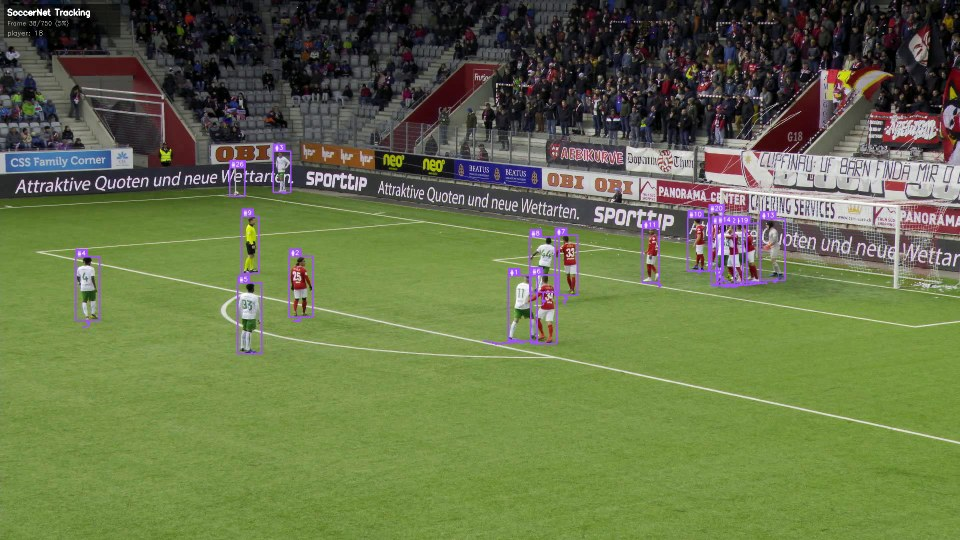
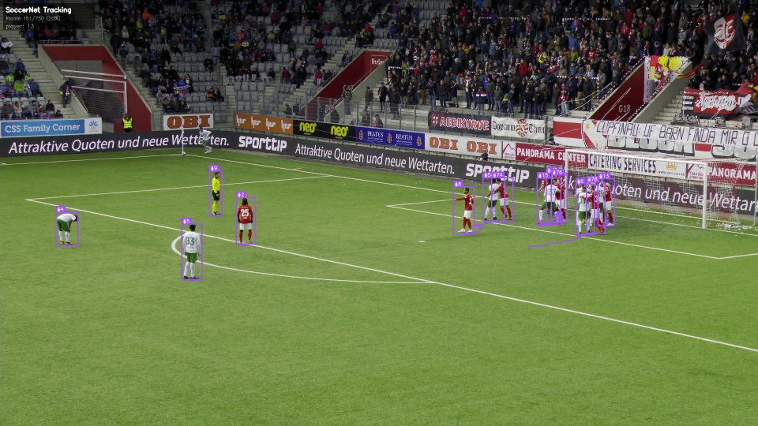
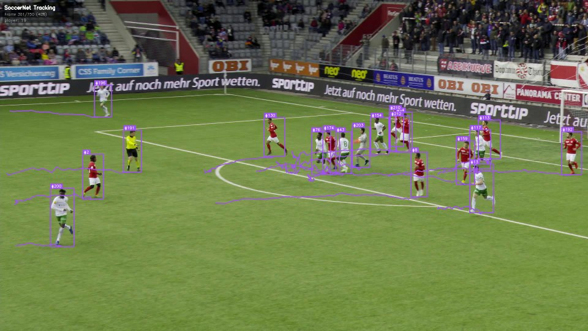

# Soccer Player Detection and Tracking

Real-time multi-object detection and tracking of soccer players
on broadcast match footage from the SoccerNet tracking benchmark.

Built using YOLO11 fine-tuned on real match footage and ByteTrack
for persistent player identification across frames.


## Results

### Training (SoccerNet tracking-2023, 57 sequences)

| Metric        | Score   |
|---------------|---------|
| mAP50         | 0.9152  |
| Precision     | 0.9282  |
| Recall        | 0.8772  |

### Evaluation on Test Set (10 sequences, 7,500 frames)

| Metric        | Score   |
|---------------|---------|
| Precision     | 0.9785  |
| Recall        | 0.8043  |
| F1 Score      | 0.8829  |
| IOU Threshold | 0.5     |
| Total TP      | 85,432  |
| Total FP      | 1,880  |
| Total FN      | 20,790  |

Evaluated on 1080p broadcast footage from major European leagues
(Premier League, La Liga, Bundesliga, Serie A).

## Architecture
SoccerNet 1080p broadcast frames (25fps)
|
v
YOLO11 fine-tuned on SoccerNet tracking-2023
(57 train sequences, 1920x1080, MOT annotations)
|
v
ByteTrack multi-object tracker
(persistent player IDs across frames)
|
v
supervision annotators
(bounding boxes, track trails, labels, stats overlay)
|
v
Annotated output video + evaluation metrics JSON

## Stack

| Component       | Tool                          |
|-----------------|-------------------------------|
| Detection       | YOLO11 (Ultralytics)          |
| Tracking        | ByteTrack via supervision     |
| Video IO        | OpenCV                        |
| Annotation      | supervision                   |
| Dataset         | SoccerNet tracking-2023       |
| Training compute| Google Colab Pro (A100)       |
| Storage         | Google Drive                  |
| Version control | GitHub                        |

## Dataset

SoccerNet tracking-2023 benchmark.
NDA required for video access: soccer-net.org

- 57 train sequences, 37 test sequences
- 750 frames per sequence at 1080p
- 25fps broadcast footage from main camera
- Ground truth bounding boxes and track IDs in MOT format
- Leagues: Premier League, La Liga, Bundesliga, Serie A,
  Ligue 1, Champions League

## Project Structure
soccer-analytics/
configs/
config.yaml              all paths and hyperparameters
src/
detector.py              YOLO11 detection wrapper
tracker.py               ByteTrack wrapper
annotator.py             frame annotation pipeline
utils.py                 shared utility functions
notebooks/
01_setup_and_data.ipynb  environment and data setup
02_download_soccernet.ipynb  dataset download
03_train.ipynb           annotation conversion and training
04_detect_and_track.ipynb  inference and evaluation
05_visualize.ipynb       results and README generation
outputs/
training_plots/          loss curves and metric plots
preview_frames/          sample annotated frames
metrics.json             full evaluation results
demo.gif                 demo animation

## Preview Frames








## Running the Project

```bash
git clone https://github.com/Kareem-Ansari/soccer-analytics.git
cd soccer-analytics
pip install -r requirements.txt
```

Open notebooks in order on Google Colab.
SoccerNet data requires NDA approval at soccer-net.org.
Trained weights available on request.

## Citation
@inproceedings{cioppa2022soccernet,
title={SoccerNet-Tracking: Multiple Object Tracking Dataset
and Benchmark in Soccer Videos},
author={Cioppa, Anthony and Giancola, Silvio and others},
booktitle={Proceedings of the IEEE/CVF Conference on
Computer Vision and Pattern Recognition},
year={2022}
}
